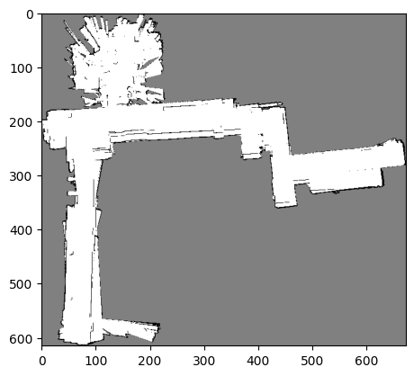

# Particle Filter SLAM

This project is concerned with the implementation of a particle filter for simultaneous localization and mapping (SLAM) in a 2D environment. 

## Installation

This project is written in Python 3.8. Install all requirements as follows:

`` pip install -r requirements.txt ``

## Data Format

The data is assumed to be in the folder `data/` as follows:

<pre>
data/
├── Encoders20.npz
├── Hokuyo20.npz
├── IMU20.npz
├── Kinect20.npz
├── RGB20/
└── Disparity20/
</pre>

# Run the code

To run the code, simply run the following command:

`` python main.py --scene 20 --num_particles 100``

This will run the particle filter for scene 20 with 100 particles. The results will be saved in the folder `outputs_{scene_number}/`.

# Code Structure

The file `main.py` is simply a script version of the notebook `Sandbox.ipynb`. This file simply manages the particle filter SLAM at a high level, by reading sensor data, calling the particle filter, and saving the results. 

The file `slam/particles.py` contains the implementation of the particle filter. The file `slam/sensors.py` contains the implementation of the sensor models. The file `slam/mapper.py` contains the code to map the environment. For details on how sensor data is processed, or how the map is constructed, please refer to the corresponding files.